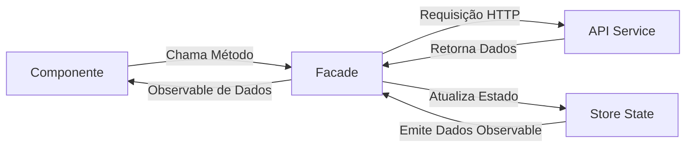

# 🐾 Pet Friends

> Sistema de relacionamento entre pets e tutores desenvolvido com Angular 19

[](https://angular.dev/)
[](https://www.typescriptlang.org/)
[](https://tailwindcss.com/)

---

## 📋 Dados do Candidato

| Campo         | Valor                             |
| ------------- | --------------------------------- |
| **Nome**      | Jackson Luiz Domingos Silva       |
| **Inscrição** | 16380                             |
| **Vaga**      | Engenheiro da Computação - Sênior |

---

## 🏗️ Arquitetura do Projeto

### Padrão Facade + Store (State Management)

O projeto utiliza uma arquitetura baseada em **Facade** para abstrair a complexidade do gerenciamento de estado e chamadas de API.



1.  **Component**: Apenas exibe dados e captura ações do usuário.
2.  **Facade**: Centraliza a lógica, chamando APIs e gerenciando o estado.
3.  **Store**: Mantém o estado da aplicação reativo (BehaviorSubject).
4.  **API**: Responsável apenas pelas requisições HTTP.

```
src/app/
├── core/                          # Serviços singleton e funcionalidades core
│   ├── auth/                      # Autenticação
│   │   ├── login/                 # Página de login
│   │   ├── sign-out/              # Página de logout
│   │   ├── auth.facade.ts         # Facade de autenticação
│   │   ├── auth.store.ts          # Estado de autenticação
│   │   ├── auth-api.service.ts    # Chamadas HTTP de auth
│   │   ├── auth-refresh.service.ts# Renovação de token
│   │   └── token-storage.service.ts
│   ├── config/                    # Configurações da aplicação
│   │   └── app-config.service.ts  # Serviço de configuração
│   ├── guards/                    # Route guards
│   │   └── auth.guard.ts          # Guard de autenticação
│   ├── i18n/                      # Internacionalização
│   │   └── pt-br-paginator-intl.ts# Tradução do paginador
│   ├── interceptors/              # HTTP interceptors
│   │   ├── auth.interceptor.ts    # Injeção de token
│   │   └── error.interceptor.ts   # Tratamento de erros
│   └── ui/                        # Serviços de UI
│       ├── confirm-dialog/        # Diálogo de confirmação
│       └── snackbar.service.ts    # Notificações
│
├── features/                      # Módulos de funcionalidades (lazy loaded)
│   ├── contacts/                  # Página de contato
│   │   ├── pages/
│   │   │   └── contact/
│   │   │       ├── contact.page.html
│   │   │       └── contact.page.ts
│   │   └── contacts.routes.ts
│   ├── health-check/              # Liveness e Readiness checks
│   │   ├── health-check/
│   │   │   ├── health.page.html
│   │   │   └── health.page.ts
│   │   ├── health.routes.ts
│   │   └── health.service.ts
│   ├── pets/                      # Gestão de pets
│   │   ├── data-access/
│   │   │   ├── pets-api.service.ts
│   │   │   ├── pets.facade.ts
│   │   │   ├── pets.models.ts
│   │   │   └── pets.store.ts
│   │   ├── pages/
│   │   │   ├── pet-detail/
│   │   │   ├── pet-form/
│   │   │   └── pets-list/
│   │   └── pets.routes.ts
│   └── tutores/                   # Gestão de tutores
│       ├── data-access/
│       │   ├── tutores-api.service.ts
│       │   ├── tutores.facade.ts
│       │   ├── tutores.models.ts
│       │   └── tutores.store.ts
│       ├── pages/
│       │   ├── tutor-detail/
│       │   ├── tutor-form/
│       │   └── tutores-list/
│       └── tutores.routes.ts
│
└── shared/                        # Componentes compartilhados
    └── components/
        ├── address-actions-sheet/ # Ações de endereço
        ├── layout/                # Header
        ├── photo-upload/          # Upload de fotos
        ├── services/              # Serviços CEP
        ├── ui/                    # ConfirmDialog, etc.
        └── utils/                 # Utilitários
```

### Padrões Utilizados

- **Facade Pattern**: Abstração da lógica de negócio
- **Store Pattern**: Gerenciamento de estado com BehaviorSubject
- **Lazy Loading**: Carregamento sob demanda das rotas
- **Standalone Components**: Componentes independentes (Angular 19)

  ***

## 🌟 Diferenciais (Extras Implementados)

Além dos requisitos solicitados, foram implementadas as seguintes funcionalidades para enriquecer o projeto:

- **🐭 Cursores Personalizados**: Ícones temáticos de patinha para experiência imersiva.
- **📱 Design Responsivo**: Interface adaptada para mobile e desktop com menu hambúrguer.
- **☁️ Docker**: Suporte completo a containerização com multi-stage build e Nginx otimizado.
- **❤️ Health Checks**: Endpoints visuais de Liveness e Readiness para monitoramento do sistema.
- **🚪 Página de Sign-Out**: Redirecionamento amigável com contagem regressiva ao sair do sistema.
- **♿ Acessibilidade (VLibras)**: Integração com widget governamental para tradução automática de conteúdo para Libras.
- **📮 Busca por CEP (BrasilAPI)**: ao digitar o CEP no cadastro de tutor, o sistema consulta a API pública e pré-preenche os dados do endereço.
- **🧭 Ações inteligentes no tutor (endereço/telefone/e-mail)**:
  - **Endereço**: abre opções de navegação (Waze/Google Maps) e **chamada de corrida (Uber)**.
  - **Telefone**: clique para ligar (`tel:`).
  - **E-mail**: clique para escrever (`mailto:`).


---

## 🚀 Como Executar

### Pré-requisitos

- Node.js 20+
- npm 10+

### Instalação

```bash
# Clonar repositório
git clone https://github.com/JacksonLuiz99/jacksonluizdomingossilva066071.git
cd jacksonluizdomingossilva066071

# Instalar dependências
npm install

# Iniciar servidor de desenvolvimento
npm start
```

Acesse: `http://localhost:4200`

### Credenciais de Teste

| Campo  | Valor          |
| ------ | -------------- |
| E-mail | jackson@db.com |
| Senha  | 123456         |

---

## 🧪 Testes

```bash
# Executar testes unitários
npm test

# Executar testes com coverage
npm run test:coverage

# Executar testes em modo headless (CI/CD)
ng test --no-watch --browsers=ChromeHeadless
```

**Status:** 18 testes passando ✅

---

## 🐳 Docker

```bash
# Build da imagem
docker build -t petfriends .

# Executar container
docker run -p 8080:80 petfriends
```

Acesse: `http://localhost:8080`

---

## 📦 Build de Produção

```bash
# Build otimizado
npm run build

```

---

## 🌐 Deploy

### Vercel 

**URL:** https://jacksonluizdomingossilva066071.vercel.app

> Deploy automático integrado ao GitHub (a cada push na branch principal).

Rotas úteis:
- Login: /login
- Pets: /pets
- Tutores: /tutores
- Health: /health


### GitHub Pages

```bash
npm run deploy
```

**URL:** https://jacksonluiz99.github.io/jacksonluizdomingossilva066071/login

---

## ✨ Funcionalidades

### Pets

- ✅ Listagem com paginação (10 itens/página)
- ✅ Busca por nome
- ✅ Cadastro, edição e exclusão
- ✅ Vizualização de tutores vinculados ao pet
- ✅ Upload e remoção de fotos

### Tutores

- ✅ Listagem com paginação (10 itens/página)
- ✅ Busca por nome
- ✅ Cadastro com busca de CEP automática, edição e exclusão
- ✅ Vinculação/desvinculação de pets
- ✅ Vizualização de pets vinculados ao tutor
- ✅ Upload de fotos

### Autenticação

- ✅ Login com JWT
- ✅ Refresh token automático
- ✅ Proteção de rotas
- ✅ Página de sign-out com countdown

### Acessibilidade

- ✅ Widget VLibras (tradução para Libras)
- ✅ Contraste adequado
- ✅ Navegação por teclado
- ✅ Autocomplete

### Health Checks

- ✅ Liveness check (aplicação rodando)
- ✅ Readiness check (API disponível)

---

## 🛠️ Tecnologias

| Categoria               | Tecnologia           |
| ----------------------- | -------------------- |
| Framework               | Angular 19           |
| Linguagem               | TypeScript 5.x       |
| Estilos                 | Tailwind CSS 3.4     |
| UI Components           | Angular Material     |
| HTTP Client             | Angular HttpClient   |
| Gerenciamento de Estado | BehaviorSubject/RxJS |
| Testes                  | Jasmine + Karma      |
| Containerização         | Docker + Nginx       |

---

## 📄 Licença

Este projeto foi desenvolvido como parte de um processo seletivo.

---

<div align="center">
  <p>Desenvolvido com 🧡 por <strong>Jackson Luiz Domingos Silva</strong></p>
</div>
